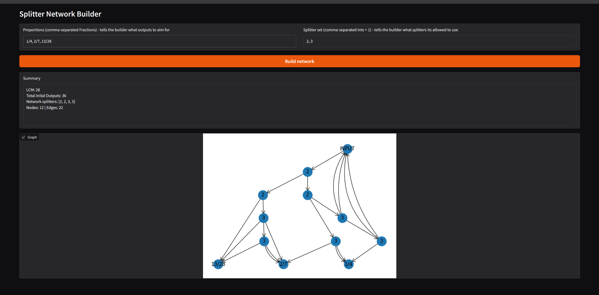
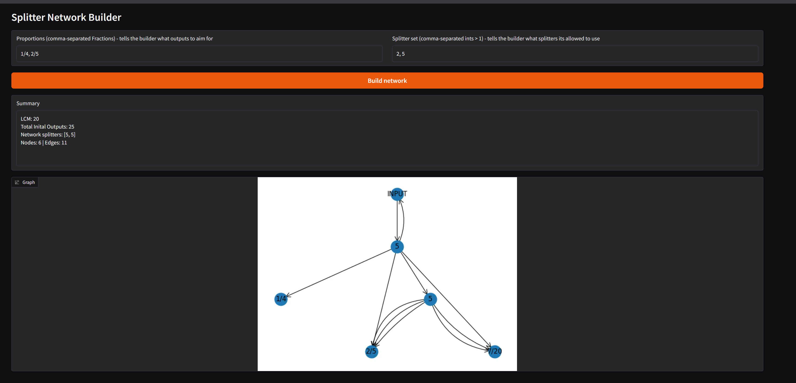

# Load-Balancing-Splitter-Network-Generator
Creates load balancing networks made of splitters to allow you to plan out your factories in your most beloved videogames such as satisfactory and so forth

also if you ever needed to decide on an outcome with probabillity 1/3 using only a fair 2 sided coin.. this is your place

THIS PROJECT NEEDS GRAPHWIZ INSTALLED ON YOUR SYSTEM TO RUN PROPERLY (find on https://graphviz.org/download/) OTHERWISE THE GRAPHS WILL LOOK WIERD

Below is an example of how the program is used - here the program was asked to make a device that splits input into 3 outputs of proportion 1/4, 2/7, 13/28 using only 2 (nodes indicated with a 2 on them) and 3 (nodes indicated with a 3 on them) splitting nodes

